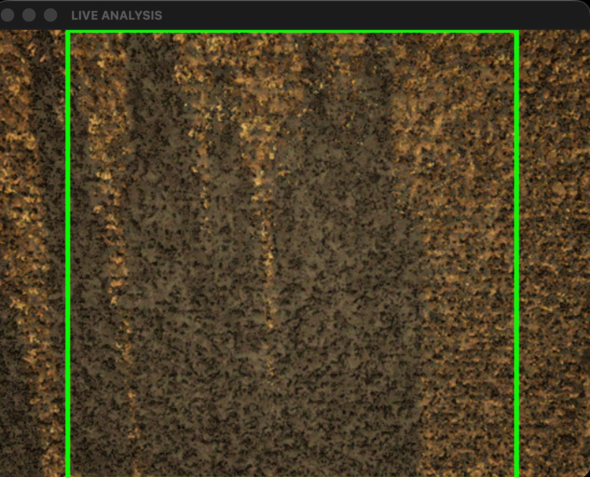
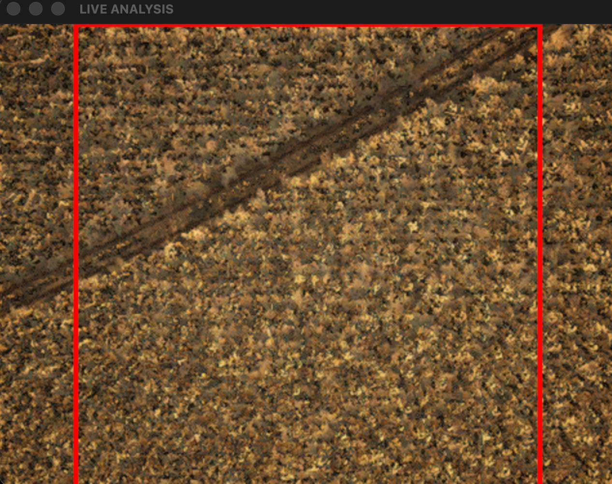

# 🚁 AgroTech AI: Drone Autopilot

Система автономного мониторинга сельскохозяйственных полей. Дрон летит по заданному маршруту («змейка») с возможностью **возврата на базу для подзарядки**, и в реальном времени анализирует поверхность с помощью нейросети, выявляя участки без посевов.

## ⚠️ Требования (Важно!)
* **Python 3.11**: Проект настроен и протестирован строго на **Python 3.11.x**. Использование более новых версий (3.12+) может привести к ошибкам несовместимости библиотек `tensorflow` и `numpy`.
* **Веса модели**: Файл `agro_cnn_model.keras` не включен в репозиторий из-за большого размера. Вы можете **[скачать его с Google Диска](https://drive.google.com/file/d/188mc_6qr-iHCXhDV3djXcX8ec-Pgo6dN/view?usp=sharing)**. После скачивания поместите файл в корневую папку проекта перед запуском.

## 🛠 Особенности проекта
* **AI Analysis:** Использование CNN (TensorFlow/Keras) для классификации поверхности (Planted / Empty).
* **Smart Navigation:** Автоматическое построение многосегментного маршрута с возвратом на дозарядку.
* **Точная посадка:** Использование П-регулятора для приземления точно на стартовую базу.
* **Модульная архитектура:** Логика разделена на независимые компоненты (навигация, телеметрия, ИИ) для удобства поддержки и тестирования.

## 📂 Структура проекта
```text
├── modules/                 # Внутренняя логика автопилота
│   ├── ai_logic.py          # Обработка кадров и предсказания нейросети
│   ├── mission.py           # Главный полетный цикл и логика перезарядки
│   ├── navigation.py        # Расчет waypoints для "змейки"
│   └── telemetry.py         # Получение данных с датчиков (GPS, высота, yaw)
├── assets/                  # Скриншоты для документации
├── autopilot_with_ai.py     # Главный скрипт для запуска (точка входа)
├── config.py                # Все настройки (IP, координаты, пороги ИИ)
└── requirements.txt         # Зависимости проекта
```

## 🚀 Быстрый старт
1. Установите зависимости:
   ```bash
   pip install -r requirements.txt

2. Поместите обученную модель agro_cnn_model.keras в корень проекта.

3. При необходимости настройте IP-адрес вашего дрона/симулятора в файле config.py.

4. Запустите миссию:**
```bash
python autopilot_with_ai.py
```


## 📊 Демонстрация работы

|    Распознавание посадок     |    Пустая земля / Следы    |
|:----------------------------:|:--------------------------:|
|  |  |

*Пример работы нейросети в симуляторе: модель успешно отличает грядки (зеленый индикатор) от теней и следов трактора (красный индикатор).*